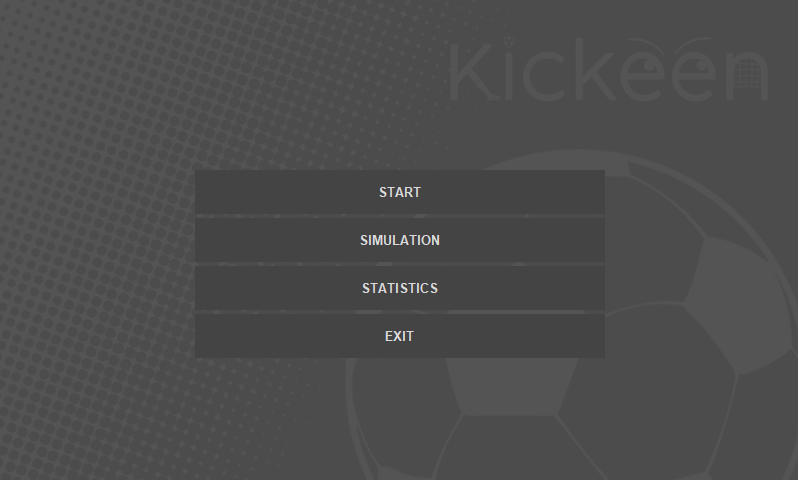

Capstone of Julien Ibalio
KICKEEN: A SMART CAMERA-BASED SOCCER ASSISTANT FOR GOAL ACCURACY MONITORING


# KICKEEN: Smart Camera-Based Soccer Assistant 

## Overview
Accurate monitoring and objective feedback of shooting performance remain a significant challenge for grassroots and amateur soccer players due to the high cost and complexity of existing commercial systems. **KICKEEN** addresses this gap by providing a **cost-effective, real-time training solution** for goal accuracy monitoring.

Built on affordable hardware and open-source software, KICKEEN empowers players to track their shooting performance, evaluate consistency, and make data-driven adjustments to their training regimen.

---

## Features
- **Stereo Camera Capture**  
  Raspberry Pi 5 connected to dual USB cameras for real-time game footage.
- **YOLOv8 Object Detection**  
  Precise identification and tracking of player, ball, and goalposts.
- **Stereo Depth Estimation & Triangulation**  
  Calculates player distance from the goal (up to 20 meters).
- **Statistics**  
  Quantitative analysis of distance and percentage.
- **Custom Python GUI**  
  Real-time feedback displayed on a 7-inch touchscreen.
- **Outdoor Reliability**  
  Tested in practical environments for consistent, objective metrics.

---

## System Architecture
1. **Hardware**
   - Raspberry Pi 5
   - Stereo USB cameras
   - 7-inch touchscreen display
   - Uninterrupted Power Supply

2. **Software**
   - Python 3.x
   - [YOLOv8](https://github.com/ultralytics/ultralytics) for object detection
   - OpenCV for image processing and stereo depth estimation
   - Custom GUI for visualization and feedback

---

## Installation

### Prerequisites
- Raspberry Pi OS (64-bit recommended)
- Python 3.9+
- USB stereo cameras connected to Raspberry Pi
- Touchscreen display configured

### Dependencies
Install required Python packages:
```bash
pip install ultralytics opencv-python numpy matplotlib
